# Use case 1: Creating a Lakehouse, ingesting sample data and building a report

**Introduction**

This lab walks you through an end-to-end scenario from data acquisition
to data consumption. It helps you build a basic understanding of Fabric,
including the different experiences and how they integrate, as well as
the professional and citizen developer experiences that come with
working on this platform. This lab isn't intended to be a reference
architecture, an exhaustive list of features and functionality, or a
recommendation of specific best practices.

Traditionally, organizations have been building modern data warehouses
for their transactional and structured data analytics needs. And data
lakehouses for big data (semi/unstructured) data analytics needs. These
two systems ran in parallel, creating silos, data duplicity, and
increased total cost of ownership.

Fabric with its unification of data store and standardization on Delta
Lake format allows you to eliminate silos, remove data duplicity, and
drastically reduce total cost of ownership.

With the flexibility offered by Fabric, you can implement either
lakehouse or data warehouse architectures or combine them together to
get the best of both with simple implementation. In this tutorial,
you're going to take an example of a retail organization and build its
lakehouse from start to finish. It uses the [medallion
architecture](https://learn.microsoft.com/en-us/azure/databricks/lakehouse/medallion) where
the bronze layer has the raw data, the silver layer has the validated
and deduplicated data, and the gold layer has highly refined data. You
can take the same approach to implement a lakehouse for any organization
from any industry.

This lab explains how a developer at the fictional Wide World Importers
company from the retail domain completes the following steps.

**Objectives**:

1\. Sign in to Power BI account and initiate a free Microsoft Fabric
trial.

2\. Start the Microsoft Fabric (Preview) trial within Power BI.

3\. Configure OneDrive sign-up for the Microsoft 365 admin center.

4\. Build and implement an end-to-end lakehouse for the organization,
including creating a Fabric workspace and a lakehouse.

5\. Ingest sample data into the lakehouse and prepare it for further
processing.

6\. Transform and prepare the data using Python/PySpark and SQL
notebooks.

7\. Create business aggregate tables using different approaches.

8\. Establish relationships between tables for seamless reporting.

9\. Build a Power BI report with visualizations based on the prepared
data.

10\. Save and store the created report for future reference and
analysis.

## Exercise 1: Setup Lakehouse end-to-end scenario

### Task 1: Sign in to Power BI account and sign up for the free Microsoft Fabric trial

1.  Open your browser, navigate to the address bar, and type or paste
    the following URL:+++https://app.fabric.microsoft.com/+++ then press
    the **Enter** button.

> 

2.  In the **Microsoft Fabric** window, enter your credentials, and
    click on the **Submit** button.

> 

3.  Then, In the **Microsoft** window enter the password and click on
    the **Sign in** button.

> 

4.  In **Stay signed in?** window, click on the **Yes** button.

> 

5.  You’ll be directed to Fabric Home page.

> 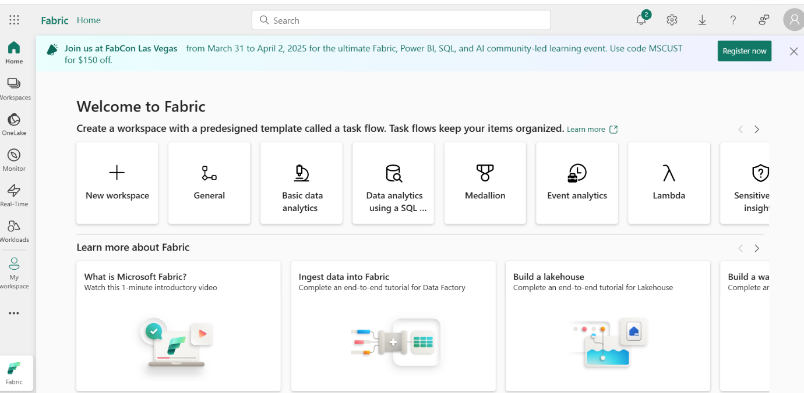

## Exercise 2: Build and implement an end-to-end lakehouse for your organization

### Task 1: Create a Fabric workspace

In this task, you create a Fabric workspace. The workspace contains all
the items needed for this lakehouse tutorial, which includes lakehouse,
dataflows, Data Factory pipelines, the notebooks, Power BI datasets, and
reports.

1.  Fabric home page, select **+New workspace** tile.

> 

2.  In the **Create a workspace** pane that appears on the right side,
    enter the following details, and click on the **Apply** button.

[TABLE]

> 

Note: To find your lab instant ID, select 'Help' and copy the instant
ID.

> 
>
> 

3.  Wait for the deployment to complete. It takes 2-3 minutes to
    complete.

> 

### Task 2: Create a lakehouse

1.  Create a new lakehouse by clicking on the **+New item** button in
    the navigation bar.

> 

2.  Click on the "**Lakehouse**" tile.

> 

3.  In the **New lakehouse** dialog box, enter +++**wwilakehouse+++** in
    the **Name** field, click on the **Create** button and open the new
    lakehouse.

> **Note**: Ensure to remove space before **wwilakehouse**.
>
> 
>
> 

4.  You will see a notification stating **Successfully created SQL
    endpoint**.

> 

### Task 3: Ingest sample data

1.  In the **wwilakehouse** page, navigate to **Get data in your
    lakehouse** section, and click on **Upload files as shown in the
    below image.**

> 

2.  On the Upload files tab, click on the folder under the Files

> 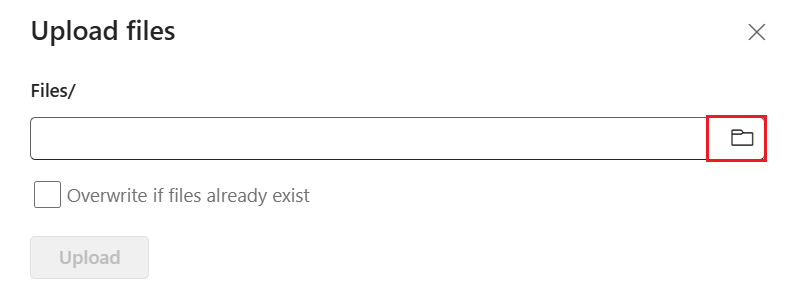

3.  Browse to **C:\LabFiles** on your VM, then
    select ***dimension_customer.csv*** file and click
    on **Open** button.

> 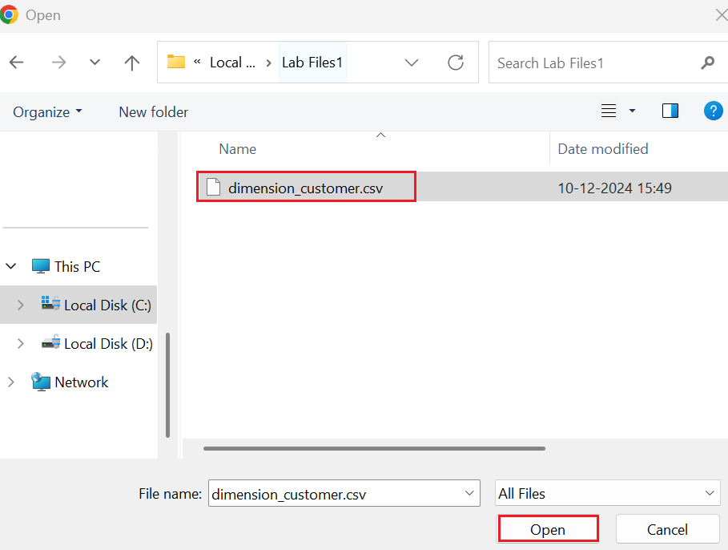

4.  Then, click on the **Upload** button and close

> 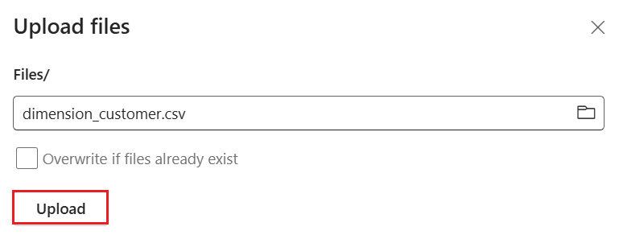

5.  Click and select refresh on the **Files**. The file appear.

> 
>
> 

6.  In the **Lakehouse** page, Under the Explorer pane select Files.
    Now, however your mouse to **dimension_customer.csv** file. Click on
    the horizontal ellipses **(…)** beside **dimension_customer**.csv.
    Navigate and click on **Load Table**, then select **New table**.

> 

7.  In the **Load file to new table** dialog box, click on
    the **Load** button.

> 
>
> 

8.  Select **dimension_coustomer** table

> 
>
> 

9.  You can also use the SQL endpoint of the lakehouse to query the data
    with SQL statements. Select **SQL analytics endpoint** from
    the **Lakehouse** drop-down menu at the top right of the screen.

> 

10. In the wwilakehouse page, under Explorer select
    the **dimension_customer** table to preview its data and
    select **New SQL query** to write your SQL statements.

> 

11. The following sample query aggregates the row count based on
    the **BuyingGroup column** of the **dimension_customer** table. SQL
    query files are saved automatically for future reference, and you
    can rename or delete these files based on your need. Paste the code
    as shown in the below image, then click on the play icon
    to **Run** the script.

> SELECT BuyingGroup, Count(\*) AS Total
>
> FROM dimension_customer
>
> GROUP BY BuyingGroup
>
> 

**Note**: If you encounter an error during the execution of the script,
then crosscheck the script syntax with the above image.

> 

12. Previously all the lakehouse tables and views were automatically
    added to the semantic model. With the recent updates, for new
    lakehouses, you have to manually add your tables to the semantic
    model.

> 

13. From the lakehouse **Reporting** tab, select **Manage default
    semantic model** and select the tables that you want to add to the
    semantic model.

> 

14. In **Manage default semantic model** tab, select
    the **dimension_customer** table and click on **Confirm.**

> 

### Task 4: Build a report

1.  Now, click on **Fabric Lakehouse** **Tutorial-XX** on the left-sided
    navigation pane.

> 

2.  Now, select **wwilakehouse** of type **SQL analytics **

> 

3.  From the lakehouse **Home** tab, select **Settings**

> 

4.  To ensure that the tables in the semantic model are always in sync,
    switch to the **SQL analytics endpoint** view and open the
    lakehouse **settings** pane. Select **Default Power BI semantic
    model** and turn on **Sync the default Power BI semantic model**

> 

5.  Now, click on **Fabric Lakehouse** **Tutorial-XX** on the left-sided
    navigation pane.

> 

6.  In the **Fabric Lakehouse Tutorial-XX** view,
    select **wwilakehouse** of Type **Semantic model(default)**. This
    dataset is automatically created and has the same name as the
    lakehouse.

> 

7.  From the semantic model pane, you can view all the tables. You have
    options to create reports either from scratch, paginated report, or
    let Power BI automatically create a report based on your data. For
    this tutorial, under **Explore this data**, select **Auto-create a
    report** as shown in the below image.

> 
>
> 
>
> 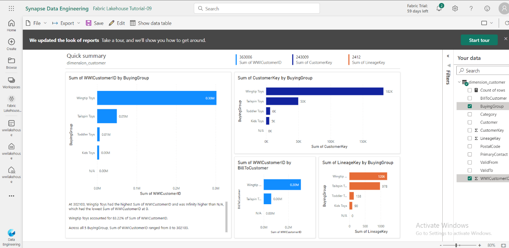

8.  Since the table is a dimension and there are no measures in it,
    Power BI creates a measure for the row count and aggregates it
    across different columns, and creates different charts as shown in
    the following image.

9.  Save this report for the future by selecting **Save** from the top
    ribbon.

> 

10. In the **Save your replort** dialog box, enter a name for your
    report as +++dimension_customer-report+++ and select **Save.**

> 

11. You will see a notification stating **Report saved**.

> 

# Exercise 2: Ingest data into the lakehouse

In this exercise, you ingest additional dimensional and fact tables from
the Wide World Importers (WWI) into the lakehouse.

### Task 1: Ingest data

1.  Now, click on **Fabric Lakehouse** **Tutorial-XX** on the left-sided
    navigation pane.

> 

2.  In the **Fabric Lakehouse Tutorial-XX** workspace page, navigate and
    click on **+New item** button, then select **Data pipeline**.

> 

3.  In the New pipeline dialog box, specify the name
    as **+++IngestDataFromSourceToLakehouse+++** and
    select **Create.** A new data factory pipeline is created and opened

> 
>
> 

4.  On newly created data factory pipeline
    i.e **IngestDataFromSourceToLakehouse**, select  **Copy data
    assistant** .

> 

5.  Next, set up an **HTTP** connection to import the sample World Wide
    Importers data into the Lakehouse. From the list of **New sources**,
    select **View more**, search for +++**Http+++** and select it.

> 

6.  In the **Connect to data source** window, enter the details from the
    table below and select **Next**.

[TABLE]

> 

7.  In the next step, enable the **Binary copy** and choose **ZipDeflate
    (.zip)** as the **Compression type** since the source is a .zip
    file. Keep the other fields at their default values and
    click **Next**.

> 

1.  In the **Connect to data destination** window, select **OneLake
    catalog** and select **wwilakehouse.** Now specify the **Root
    folder** as **Files** and click **Next**. This will write the data
    to the **Files** section of the lakehouse.

> 
>
> 

2.  Choose the **File format** shoul be  empty for the destination.
    Click **Next** and then **Save+Run**. You can schedule pipelines to
    refresh data periodically. In this tutorial, we only run the
    pipeline once.

> 

3.  The data copy process takes approximately 20-26 minutes to complete.

> 
>
> 

4.  Under the Output tab, select **Copy_a1n** to look at the details of
    the data transfer. After seeing the **Status** as **Succeeded**,
    click on the **Close** button.

> 
>
> 

5.  After the successful execution of the pipeline, go to your lakehouse
    (**wwilakehouse**) and open the explorer to see the imported data.

> 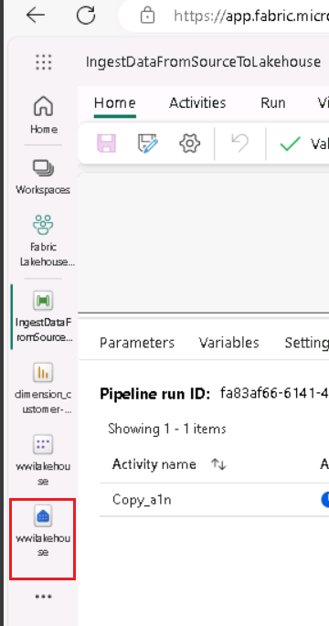

6.  Verify that the folder **WideWorldImportersDW** is present in
    the **Explorer** view and contains data for all tables.

> 

7.  The data is created under the **Files** section of the lakehouse
    explorer. A new folder with GUID contains all the needed data.
    Rename the GUID to +++**wwi-raw-data**+++

> 
>
> 

# Exercise 3: Prepare and transform data in the lakehouse

### Task 1: Prepare data

From the previous exercise steps, we have raw data ingested from the
source to the **Files** section of the lakehouse. Now you can transform
that data and prepare it for creating delta tables.

1.  Now, click on **Fabric Lakehouse** **Tutorial-XX** on the left-sided
    navigation pane.

> 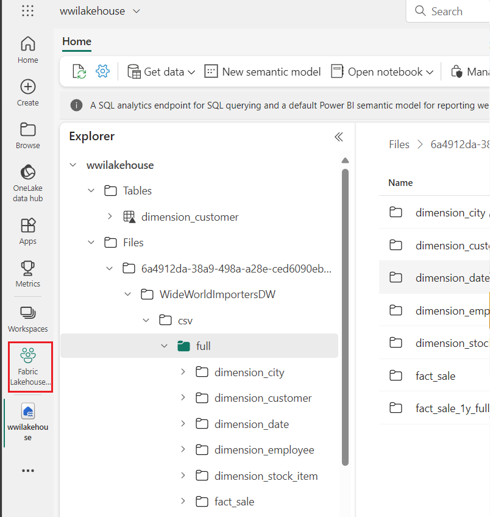

2.  In the **Home** page, navigate to **Import** section, click
    on **Notebook** and click on **From this computer**

> 

3.  Select **Upload** from thenavigate to **Import** section, click
    on **Notebook** and click on **From this computer**

> **Note**: Ensure to select **All files (\*.\*)** from the dropdown
> beside **File name** field. 
>
> 

4.  Navigate and select **01-Create Delta Tables, 02-Data
    Transformation-Business Aggregation** notebook
    from **C:\LabFiles** and click on the **Open** button.

> 

5.  You will see a notification stating **Imported successfully.**

> 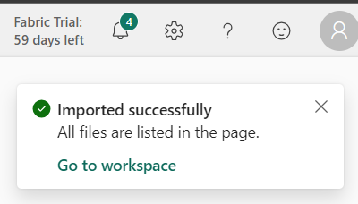

6.  After the import is successful, to see the newly imported notebooks

> 

7.  In **Fabric Lakehouse Tutorial-XX** pane,
    select **wwilakehouse** lakehouse to open it.

> 

### Task 2: Transform data and load to silver Delta table

1.  In the **wwilakehouse** page, navigate and click on **Open
    notebook** drop in the command bar, then select **Existing
    notebook**.

> 

2.  From the list of **Open existing notebook**, select the **01 -
    Create Delta Tables** notebook and select **Open**.

> 

3.  In the open notebook in **Lakehouse explorer**, you see the notebook
    is already linked to your opened lakehouse.

> 

\*\* Note\*\*

Fabric provides
the [**V-order**](https://learn.microsoft.com/en-us/fabric/data-engineering/delta-optimization-and-v-order) capability
to write optimized delta lake files. V-order often improves compression
by three to four times and up to 10 times performance acceleration over
the Delta Lake files that aren't optimized. Spark in Fabric dynamically
optimizes partitions while generating files with a default 128 MB size.
The target file size may be changed per workload requirements using
configurations. With the [**optimize
write**](https://learn.microsoft.com/en-us/fabric/data-engineering/delta-optimization-and-v-order#what-is-optimized-write) capability,
the Apache Spark engine that reduces the number of files written and
aims to increase individual file size of the written data.

4.  Before you write data as delta lake tables in the **Tables** section
    of the lakehouse, you use two Fabric features
    (**V-order** and **Optimize Write**) for optimized data writing and
    for improved reading performance. To enable these features in your
    session, set these configurations in the first cell of your
    notebook.

5.  To start the notebook and execute the cell, select the **Run** icon
    that appears to the left of the cell upon hover.

> 
>
> When running a cell, you didn't have to specify the underlying Spark
> pool or cluster details because Fabric provides them through Live
> Pool. Every Fabric workspace comes with a default Spark pool, called
> Live Pool. This means when you create notebooks, you don't have to
> worry about specifying any Spark configurations or cluster details.
> When you execute the first notebook command, the live pool is up and
> running in a few seconds. And the Spark session is established and it
> starts executing the code. Subsequent code execution is almost
> instantaneous in this notebook while the Spark session is active. 
>
> 

6.  Next, you read raw data from the **Files** section of the lakehouse
    and add more columns for different date parts as part of the
    transformation. You use partitionBy Spark API to partition the data
    before writing it as delta table based on the newly created data
    part columns (Year and Quarter).

7.  To execute the second cell, select **Run** icon that appears to the
    left of the cell upon hover.

**Note**: In case, you are unable to see the output, then click on the
horizontal lines on the left side of **Spark jobs**.

from pyspark.sql.functions import col, year, month, quarter

table_name = 'fact_sale'

df =
spark.read.format("parquet").load('Files/wwi-raw-data/full/fact_sale_1y_full')

df = df.withColumn('Year', year(col("InvoiceDateKey")))

df = df.withColumn('Quarter', quarter(col("InvoiceDateKey")))

df = df.withColumn('Month', month(col("InvoiceDateKey")))

df.write.mode("overwrite").format("delta").partitionBy("Year","Quarter").save("Tables/" +
table_name)

>  

8.  After the fact tables load, you can move on to loading data for the
    rest of the dimensions. The following cell creates a function to
    read raw data from the **Files** section of the lakehouse for each
    of the table names passed as a parameter. Next, it creates a list of
    dimension tables. Finally, it loops through the list of tables and
    creates a delta table for each table name that's read from the input
    parameter.

9.  Select the cell, and click the **Run** icon that appears to the left
    of the cell when you hover over it

> 
>
> 

10. To validate the created tables, click and select refresh on
    the **Tables**. The tables appear. 

> 
>
>  

11. Go the items view of the workspace again, select **Fabric Lakehouse
    Tutorial-XX** and select the **wwilakehouse** lakehouse to open it.

> 
>
> 

12. Now, open the second notebook. In the lakehouse view, dropdown
    the **Open notebook** and select **Existing notebook** from the top
    navigation menu.

> 

13. From the list of Open existing notebook, select the **02 - Data
    Transformation - Business** **Aggregation** notebook and click on
    the **Open**.

> 

14. In the open notebook in **Lakehouse explorer**, you see the notebook
    is already linked to your opened lakehouse.

> 

15. To start the notebook and select the 1^(st) cell and select
    the **Run** icon that appears to the left of the cell upon hover.

> 
>
> 

16. An organization might have data engineers working with Scala/Python
    and other data engineers working with SQL (Spark SQL or T-SQL), all
    working on the same copy of the data. Fabric makes it possible for
    these different groups, with varied experience and preference, to
    work and collaborate. The two different approaches transform and
    generate business aggregates. You can pick the one suitable for you
    or mix and match these approaches based on your preference without
    compromising on the performance:

    - **Approach \#1** - Use PySpark to join and aggregates data for
      generating business aggregates. This approach is preferable to
      someone with a programming (Python or PySpark) background.

    - **Approach \#2** - Use Spark SQL to join and aggregates data for
      generating business aggregates. This approach is preferable to
      someone with SQL background, transitioning to Spark.

17. **Approach \#1 (sale_by_date_city)** - Use PySpark to join and
    aggregate data for generating business aggregates. With the
    following code, you create three different Spark dataframes, each
    referencing an existing delta table. Then you join these tables
    using the dataframes, do group by to generate aggregation, rename a
    few of the columns, and finally write it as a delta table in
    the **Tables** section of the lakehouse to persist with the data.

In this cell, you create three different Spark dataframes, each
referencing an existing delta table.

> df_fact_sale = spark.read.table("wwilakehouse.fact_sale")
>
> df_dimension_date = spark.read.table("wwilakehouse.dimension_date")
>
> df_dimension_city = spark.read.table("wwilakehouse.dimension_city")
>
> 

18. In this cell, you join these tables using the dataframes created
    earlier, do group by to generate aggregation, rename a few of the
    columns, and finally write it as a delta table in
    the **Tables** section of the lakehouse.

> sale_by_date_city = df_fact_sale.alias("sale") \\
>
> .join(df_dimension_date.alias("date"), df_fact_sale.InvoiceDateKey ==
> df_dimension_date.Date, "inner") \\
>
> .join(df_dimension_city.alias("city"), df_fact_sale.CityKey ==
> df_dimension_city.CityKey, "inner") \\
>
> .select("date.Date", "date.CalendarMonthLabel", "date.Day",
> "date.ShortMonth", "date.CalendarYear", "city.City",
> "city.StateProvince",
>
> "city.SalesTerritory", "sale.TotalExcludingTax", "sale.TaxAmount",
> "sale.TotalIncludingTax", "sale.Profit")\\
>
> .groupBy("date.Date", "date.CalendarMonthLabel", "date.Day",
> "date.ShortMonth", "date.CalendarYear", "city.City",
> "city.StateProvince",
>
> "city.SalesTerritory")\\
>
> .sum("sale.TotalExcludingTax", "sale.TaxAmount",
> "sale.TotalIncludingTax", "sale.Profit")\\
>
> .withColumnRenamed("sum(TotalExcludingTax)",
> "SumOfTotalExcludingTax")\\
>
> .withColumnRenamed("sum(TaxAmount)", "SumOfTaxAmount")\\
>
> .withColumnRenamed("sum(TotalIncludingTax)",
> "SumOfTotalIncludingTax")\\
>
> .withColumnRenamed("sum(Profit)", "SumOfProfit")\\
>
> .orderBy("date.Date", "city.StateProvince", "city.City")
>
> sale_by_date_city.write.mode("overwrite").format("delta").option("overwriteSchema",
> "true").save("Tables/aggregate_sale_by_date_city")
>
> 

19. **Approach \#2 (sale_by_date_employee)** - Use Spark SQL to join and
    aggregate data for generating business aggregates. With the
    following code, you create a temporary Spark view by joining three
    tables, do group by to generate aggregation, and rename a few of the
    columns. Finally, you read from the temporary Spark view and finally
    write it as a delta table in the **Tables** section of the lakehouse
    to persist with the data.

In this cell, you create a temporary Spark view by joining three tables,
do group by to generate aggregation, and rename a few of the columns.

%%sql

CREATE OR REPLACE TEMPORARY VIEW sale_by_date_employee

AS

SELECT

DD.Date, DD.CalendarMonthLabel

, DD.Day, DD.ShortMonth Month, CalendarYear Year

,DE.PreferredName, DE.Employee

,SUM(FS.TotalExcludingTax) SumOfTotalExcludingTax

,SUM(FS.TaxAmount) SumOfTaxAmount

,SUM(FS.TotalIncludingTax) SumOfTotalIncludingTax

,SUM(Profit) SumOfProfit

FROM wwilakehouse.fact_sale FS

INNER JOIN wwilakehouse.dimension_date DD ON FS.InvoiceDateKey = DD.Date

INNER JOIN wwilakehouse.dimension_Employee DE ON FS.SalespersonKey =
DE.EmployeeKey

GROUP BY DD.Date, DD.CalendarMonthLabel, DD.Day, DD.ShortMonth,
DD.CalendarYear, DE.PreferredName, DE.Employee

ORDER BY DD.Date ASC, DE.PreferredName ASC, DE.Employee ASC

> 

20. In this cell, you read from the temporary Spark view created in the
    previous cell and finally write it as a delta table in
    the **Tables** section of the lakehouse.

21. sale_by_date_employee = spark.sql("SELECT \* FROM
    sale_by_date_employee")

22. sale_by_date_employee.write.mode("overwrite").format("delta").option("overwriteSchema",
    "true").save("Tables/aggregate_sale_by_date_employee")

> 

23. To validate the created tables, click and select refresh on
    the **Tables**. The aggregate tables appear.

> 
>
> 

Both the approaches produce a similar outcome. You can choose based on
your background and preference, to minimize the need for you to learn a
new technology or compromise on the performance.

Also you may notice that you're writing data as delta lake files. The
automatic table discovery and registration feature of Fabric picks up
and registers them in the metastore. You don't need to explicitly
call CREATE TABLE statements to create tables to use with SQL.

# Exercise 4: Building reports in Microsoft Fabric

In this section of the tutorial, you create a Power BI data model and
create a report from scratch.

### Task 1: Explore data in the silver layer using the SQL endpoint

Power BI is natively integrated in the whole Fabric experience. This
native integration brings a unique mode, called DirectLake, of accessing
the data from the lakehouse to provide the most performant query and
reporting experience. DirectLake mode is a groundbreaking new engine
capability to analyze very large datasets in Power BI. The technology is
based on the idea of loading parquet-formatted files directly from a
data lake without having to query a data warehouse or lakehouse
endpoint, and without having to import or duplicate data into a Power BI
dataset. DirectLake is a fast path to load the data from the data lake
straight into the Power BI engine, ready for analysis.

In traditional DirectQuery mode, the Power BI engine directly queries
the data from the source to execute each query, and the query
performance depends on data retrieval speed. DirectQuery eliminates the
need to copy data, ensuring that any changes in the source are
immediately reflected in the query results during the import. On the
other hand, in Import mode performance is better because the data is
readily available in the memory without querying data from the source
for each query execution. However, the Power BI engine must first copy
the data into memory during data refresh. Only changes to the underlying
data source are picked up during the next data refresh(in scheduled as
well as on-demand refresh).

DirectLake mode now eliminates this import requirement by loading the
data files directly into memory. Because there's no explicit import
process, it's possible to pick up any changes at the source as they
occur, thus combining the advantages of DirectQuery and import mode
while avoiding their disadvantages. DirectLake mode is therefore the
ideal choice for analyzing very large datasets and datasets with
frequent updates at the source.

1.  From your left navigation pane, select **Fabric_LakehouseXX** and
    then select **wwilakehouse** of **Type** **SQL analytics endpoint.**

> 
>
> 

2.  From the SQL endpoint pane, you should be able to see all the tables
    you created. If you don't see them yet, select the **Refresh** icon
    at the top. Next, select the **Model layouts** tab at the bottom to
    open the default Power BI dataset.

> 

3.  For this data model, you need to define the relationship between
    different tables so that you can create reports and visualizations
    based on data coming across different tables.Click on **Auto
    layout** 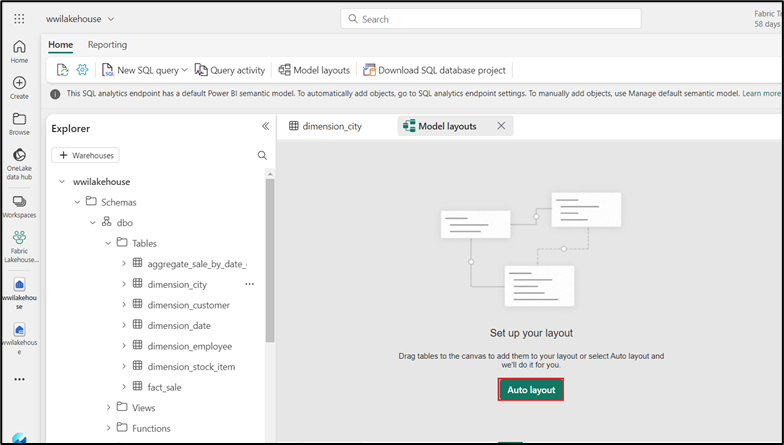 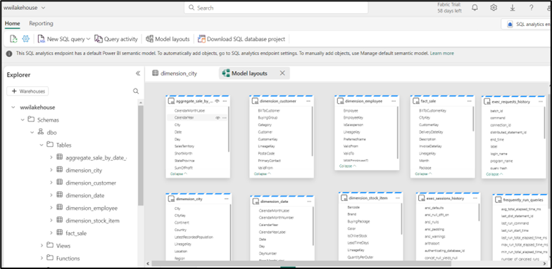

4.  From the **fact_sale** table, drag the **CityKey** field and drop it
    on the **CityKey** field in the **dimension_city** table to create a
    relationship. The **Create Relationship** dialog box appears.

> Note: Rearrange the tables by clicking on the table, dragging and
> dropping to have the dimension_city and the fact_sale tables next to
> each other. The same holds good for any two tables that you are trying
> to create relationship. This is just to make the drag and drop of the
> columns between the tables is easier. 

5.  In the **Create Relationship** dialog box:

    - **Table 1** is populated with **fact_sale** and the column
      of **CityKey**.

    - **Table 2** is populated with **dimension_city** and the column
      of **CityKey**.

    - Cardinality: **Many to one (\*:1)**

    - Cross filter direction: **Single**

    - Leave the box next to **Make this relationship active** selected.

    - Select the box next to **Assume referential integrity.**

    - Select **Save.**

> 

6.  Next, add these relationships with the same **Create
    Relationship** settings as shown above but with the following tables
    and columns:

    - **StockItemKey(fact_sale)** - **StockItemKey(dimension_stock_item)**

> 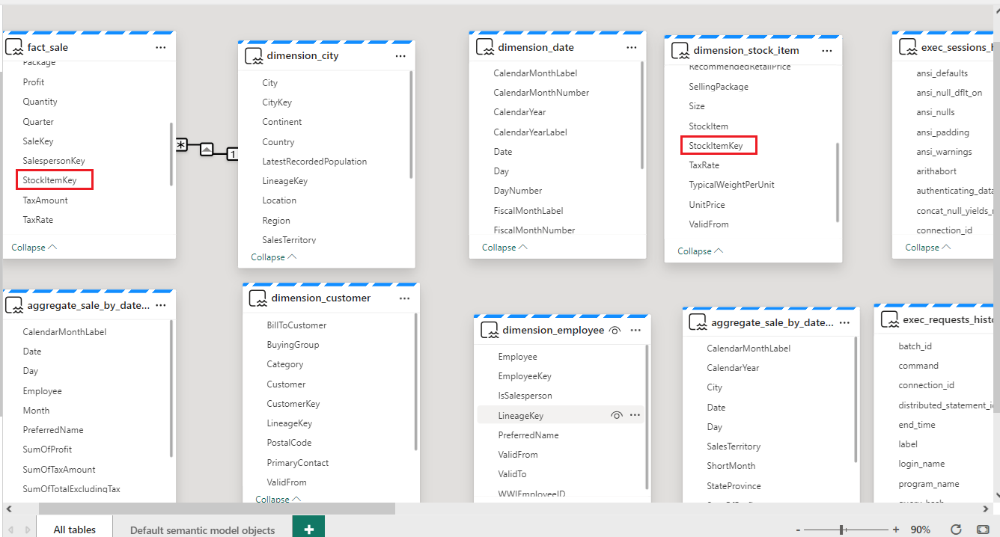
>
> 

- **Salespersonkey(fact_sale)** - **EmployeeKey(dimension_employee)**

> 

7.  Ensure to create the relationships between the below two sets using
    the same steps as above.

    - **CustomerKey(fact_sale)** - **CustomerKey(dimension_customer)**

    - **InvoiceDateKey(fact_sale)** - **Date(dimension_date)**

8.  After you add these relationships, your data model should be as
    shown in the below image and is ready for reporting.

> 

### Task 2: Build Report

1.  From the top ribbon, select **Reporting** and select **New
    report** to start creating reports/dashboards in Power BI.

> 
>
> 

2.  On the Power BI report canvas, you can create reports to meet your
    business requirements by dragging required columns from
    the **Data** pane to the canvas and using one or more of available
    visualizations.

> 

**Add a title:**

3.  In the Ribbon, select **Text box**. Type in **WW Importers Profit
    Reporting**. **Highlight** the **text** and increase size to **20**.

> 

4.  Resize the text box and place it in the **upper left** of the report
    page and click outside the textbox.

> 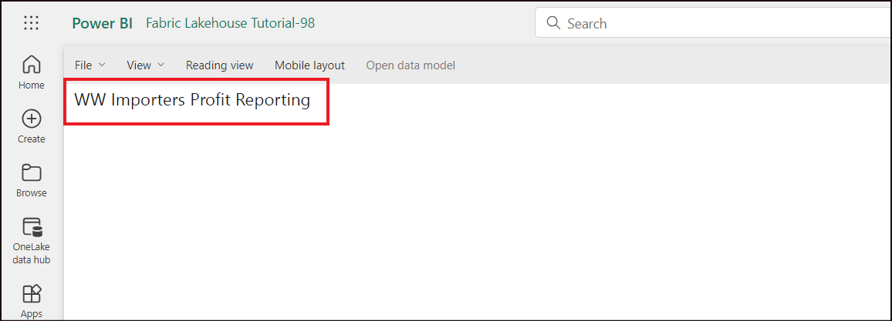

**Add a Card:**

- On the **Data** pane, expand **fact_sales** and check the box next
  to **Profit**. This selection creates a column chart and adds the
  field to the Y-axis.

> 

5.  With the bar chart selected, select the **Card** visual in the
    visualization pane.

> 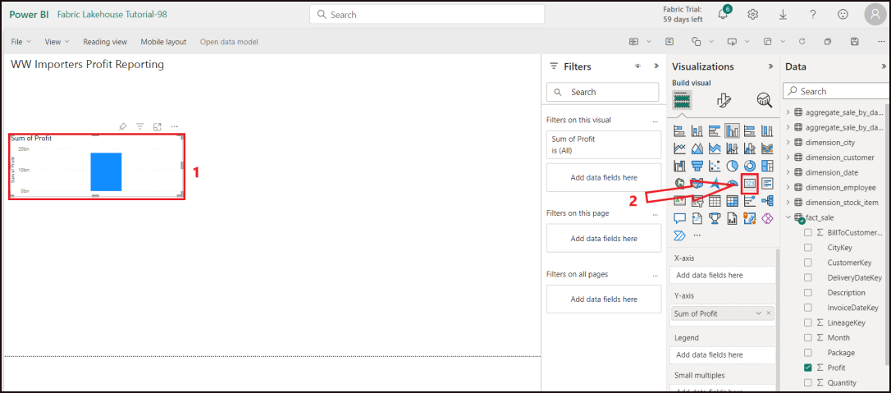

6.  This selection converts the visual to a card. Place the card under
    the title.

> 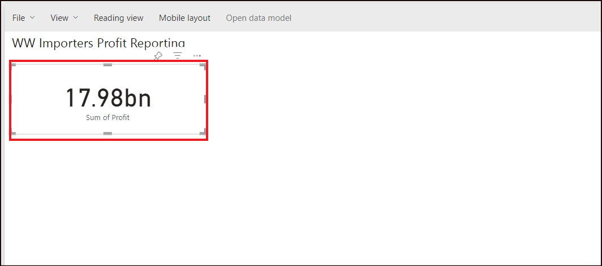

7.  Click anywhere on the blank canvas (or press the Esc key) so the
    Card that we just placed is no longer selected.

**Add a Bar chart:**

8.  On the **Data** pane, expand **fact_sales** and check the box next
    to **Profit**. This selection creates a column chart and adds the
    field to the Y-axis. 

> 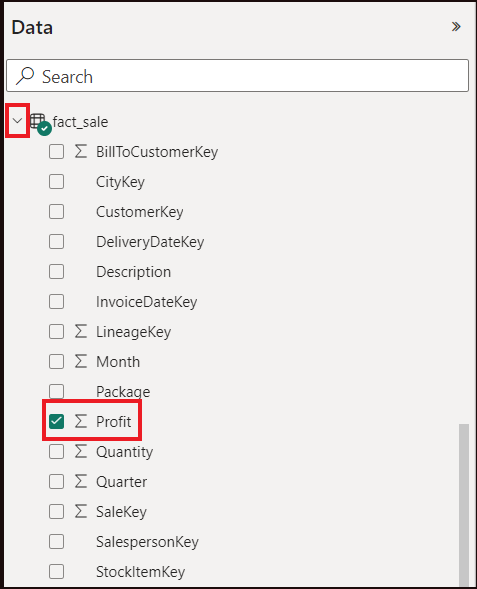

9.  On the **Data** pane, expand **dimension_city** and check the box
    for **SalesTerritory**. This selection adds the field to the
    Y-axis. 

> 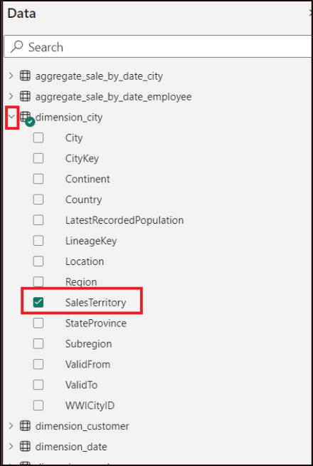

10. With the bar chart selected, select the **Clustered bar
    chart** visual in the visualization pane. This selection converts
    the column chart into a bar chart.

> 

11. Resize the Bar chart to fill in the area under the title and Card.

> 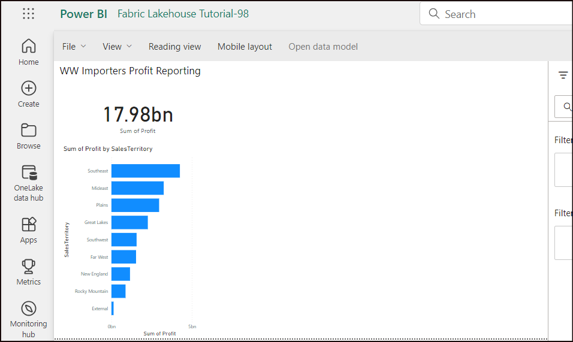

12. Click anywhere on the blank canvas (or press the Esc key) so the bar
    chart is no longer selected.

**Build a stacked area chart visual:**

13. On the **Visualizations** pane, select the **Stacked area
    chart** visual.

> 

14. Reposition and resize the stacked area chart to the right of the
    card and bar chart visuals created in the previous steps.

> 

15. On the **Data** pane, expand **fact_sales** and check the box next
    to **Profit**. Expand **dimension_date** and check the box next
    to **FiscalMonthNumber**. This selection creates a filled line chart
    showing profit by fiscal month.

> 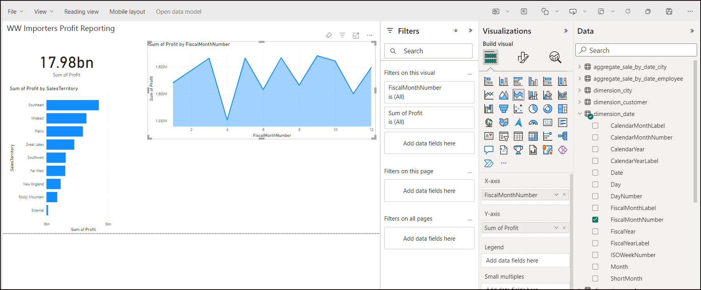

16. On the **Data** pane, expand **dimension_stock_item** and
    drag **BuyingPackage** into the Legend field well. This selection
    adds a line for each of the Buying Packages.

>  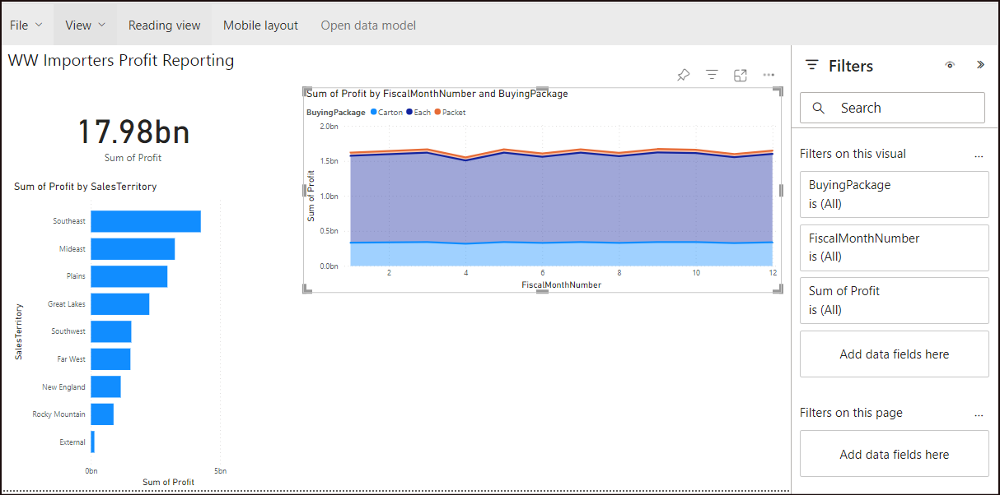

17. Click anywhere on the blank canvas (or press the Esc key) so the
    stacked area chart is no longer selected.

**Build a column chart:**

18. On the **Visualizations** pane, select the **Stacked column
    chart** visual.

> 

19. On the **Data** pane, expand **fact_sales** and check the box next
    to **Profit**. This selection adds the field to the Y-axis.

20.  On the **Data** pane, expand **dimension_employee** and check the
    box next to **Employee**. This selection adds the field to the
    X-axis.

> 

21. Click anywhere on the blank canvas (or press the Esc key) so the
    chart is no longer selected.

22. From the ribbon, select **File** \> **Save**.

> 

23. Enter the name of your report as **Profit Reporting**.
    Select **Save**.

> 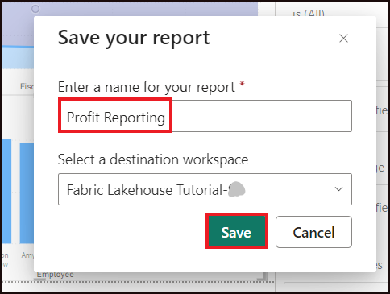

24. You will get a notification stating that the report has been
    saved. 

# Exercise 5: Clean up resources

You can delete individual reports, pipelines, warehouses, and other
items or remove the entire workspace. Use the following steps to delete
the workspace you created for this tutorial.

1.  Select your workspace, the **Fabric Lakehouse Tutorial-XX** from the
    left-hand navigation menu. It opens the workspace item view.

> 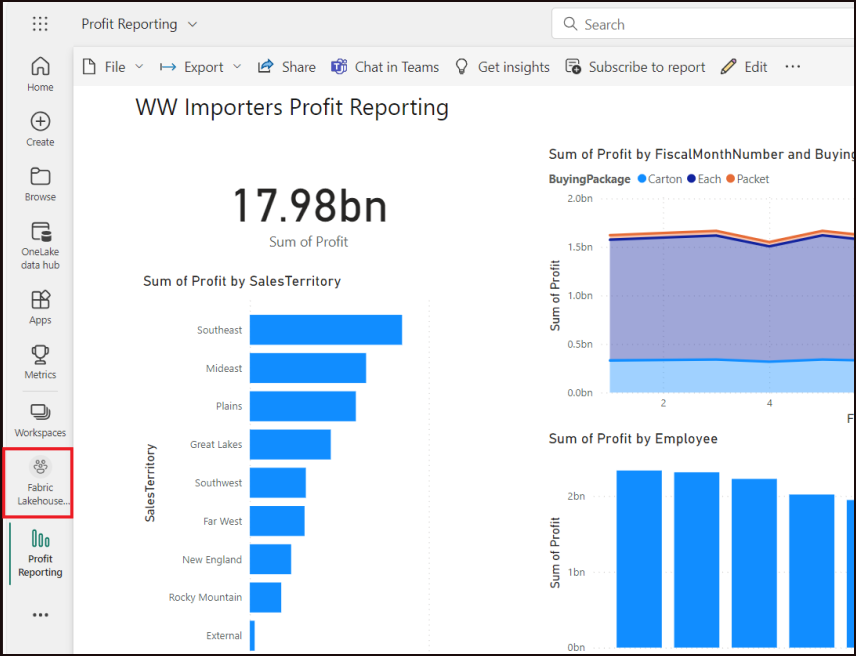

2.  Select the **...** option under the workspace name and
    select **Workspace settings**.

> 

3.  Select **Other** and **Remove this workspace.**

> 

4.  Click on **Delete** in the warning that pops up.

> 

5.  Wait for a notification that the Workspace has been deleted, before
    proceeding to the next lab.

> 

**Summary**: This practical lab focuses on setting up and configuring
essential components within Microsoft Fabric and Power BI for data
management and reporting. It includes tasks like activating trials,
configuring OneDrive, creating workspaces, and setting up lakehouses.
The lab also covers tasks related to ingesting sample data, optimizing
delta tables, and building reports in Power BI for effective data
analysis. The objectives aim to provide hands-on experience in utilizing
Microsoft Fabric and Power BI for data management and reporting purpo
